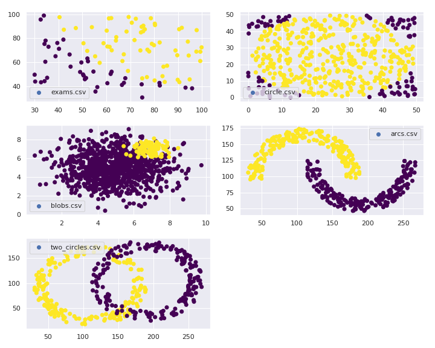

# Logistic Regression 2

In the directory `data` there are five data sets, each with two parameters and a binary label:

For each data set, implement logistic regression to find a decision boundary curve using

1. a linear function
2. a quadratic polynomial function
3. a cubic polynomial function.

You must plot data points and the decision boundary line for each case.
Upload plots showing the decision boundary for each data set and the polynomial function
as images in the repository. Print the accuracy score in the plot.

Analyze how the degree of the polynomial affects accuracy of the model.

As an example, you may use a program in the directory `example` implements logistic
regression for the linear function, and plots data points and the decision
boundary line.
